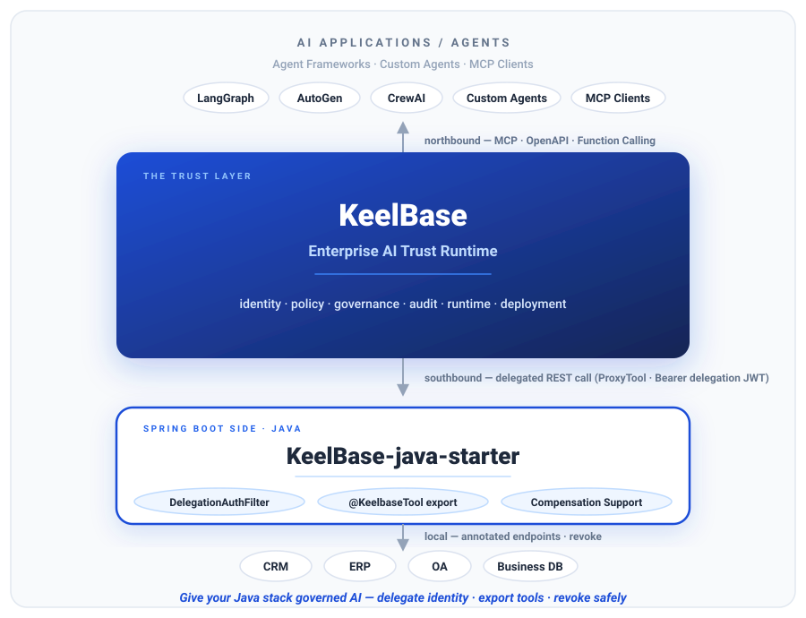

# KeelBase Java Starter

> **让存量 Java/Spring 系统获得受治理的 AI 能力**——基于 [KeelBase](https://github.com/rain6fish/KeelBase) 的 Spring Boot Starter：委托身份验签、代理工具导出、撤销补偿端点。Apache-2.0。

> KeelBase 是开源「企业 AI 信任运行时」。用本 Starter，你的存量 Java/Spring REST 端点即可成为 AI 工具——AI 在你的真实数据上干活，全程过 KeelBase 治理层（行级权限 / 写操作人工确认 / 防篡改审计哈希链 / 副作用可撤销）。

<p align="center">
  
</p>

## 试用征集（0.1.7）

> **0.1.7 已具备生产接入能力**：接入健康度自检、零样板工具导出、3 个参考项目（CRM / PM / Approval）、本地调试、Boot 2 / Java 8 适配路径。欢迎集成商试用反馈——反馈将决定 1.0 API 冻结。
> **0.1.7 is production-wiring ready** — trial it and open a GitHub Issue with what blocked you or what's missing.

- **5 分钟试用**：clone → `mvn install` → 起 `keelbase-java-example` → `node scripts/verify-java-local.mjs`（接入自检）
- **参考项目**：[CRM](docs/reference-project-crm.zh-CN.md) · [PM](docs/reference-project-pm.md) · [Approval](docs/reference-project-approval.md)
- **完整开发路径**：[开发使用手册](docs/development-guide.md)
- **反馈**：GitHub Issues（https://github.com/rain6fish/KeelBase-java-starter/issues）

## 它能做什么

1. **委托身份**（`DelegationAuthFilter`）：校验 KeelBase 转发请求携带的委托 JWT（HS256 + audience + issuer + 过期），映射到本地用户，注入 `@DelegationUser DelegationPrincipal`。无 Spring Security 也能用；classpath 含 Security 时自动写入 SecurityContext。`secret` 与 `audience` 均为必填——缺任一项启动即失败（fail-fast）。
2. **工具声明 + 导出**（`@KeelbaseTool`）：给 `@RestController` 方法加注解，`GET /keelbase/proxy-tools/export` 导出 `ai_proxy_tools` 配置——写入 KeelBase Settings 即注册为 AI 工具。类型/风险级/参数口径与 KeelBase 生成器对齐；参数提取对齐 Jackson（继承 / @JsonIgnore / record）；audience 单一来源（tools 回退 delegation）。
3. **补偿脚手架**（`KeelBaseCompensationSupport`）：AI 写副作用的撤销补偿端点——委托身份 + 幂等 + 审计，开箱即用。
4. **诊断端点**（`GET /keelbase/status`）：委托配置、解析后的导出 audience、工具计数与配置告警——绝不泄露密钥。

## 文档

| 主题 | 说明 |
|---|---|
| [架构与数据流](docs/architecture.zh-CN.md) | 总览——控制面/数据面、三条数据流（调用/写+撤销/反向）、委托身份桥 |
| [开发使用手册](docs/development-guide.md) | 从零接入的完整开发路径（依赖/配置/工具/委托身份/补偿/自检/测试/发布）|
| [快速开始](docs/quickstart.zh-CN.md) | 10 分钟端到端接入指南 |
| [配置参考](docs/configuration.zh-CN.md) | 全量属性参考 + audience 解析规则 |
| [委托身份与授权](docs/delegated-identity.zh-CN.md) | JWT、验签、用户映射、Spring Security、行级归属 |
| [工具声明与导出](docs/tool-declaration.zh-CN.md) | 注解、参数提取、类型映射、风险级 |
| [补偿与撤销](docs/compensation.zh-CN.md) | 撤销调用契约、幂等、审计、多实例 |
| [客户端与审计上报](docs/client.zh-CN.md) | 委托 token 生命周期（`KeelbaseClient`）+ 审计上报 |
| [参考项目 CRM](docs/reference-project-crm.zh-CN.md) | Integrator Kit 参考项目：传统 Java CRM → AI CRM（Java 侧真实实现） |
| [工具模式](docs/tool-patterns.zh-CN.md) | 配方：分页、筛选、枚举参数、springdoc 描述、类级工具、写+撤销 |
| [Maven 插件](docs/maven-plugin.zh-CN.md) | `keelbase:export/register` 一键导出/注册，配合热更新免重启 |
| [Gradle 使用](docs/gradle-usage.zh-CN.md) | 消费侧 Gradle 指南：依赖、配置、版本 |
| [CI 接入合规模板](docs/ci-integration.zh-CN.md) | GitHub Actions 样板：契约测试 + 自检 + 导出门禁，合规持续守护 |
| [排障与 FAQ](docs/troubleshooting.zh-CN.md) | 错误码、常见坑、核对清单 |
| [生产上线核对清单](docs/production-checklist.zh-CN.md) | 上线硬化、密钥轮换、运维监控 |

英文版在同目录（`.md`）。

## 快速开始（示例）

```bash
# 1. 启动示例（默认 8081）
cd keelbase-java-example
mvn spring-boot:run

# 2. 诊断接线（委托配置 / 解析后 audience / 工具计数 / 告警）
curl http://localhost:8081/keelbase/status

# 3. 导出 ai_proxy_tools 配置
curl http://localhost:8081/keelbase/proxy-tools/export

# 4. 写入 KeelBase（PUT /settings/ai_proxy_tools，value 为导出 JSON 的字符串）——热更新生效，免重启
```

已发布到 Maven Central——直接加依赖 `cn.com.keelbase:keelbase-spring-boot-starter:0.1.7`（0.1.0–0.1.7 均已上线）。开发快照版（`0.1.7-SNAPSHOT`）需 `mvn install` 本地安装一次。发布自动化（`-Prelease` profile + Central Portal token 流程）已配置——见 [docs/release-central.md](docs/release-central.md)。完整步骤见 [docs/quickstart.zh-CN.md](docs/quickstart.zh-CN.md)。

## 配置（application.yml）

```yaml
keelbase:
  delegation:
    secret: ${KEELBASE_DELEGATION_SECRET:}          # 必填，与 KeelBase DELEGATION_SECRET 一致（≥32 字节）
    audience: legacy-crm                             # 必填，须等于 ai_proxy_tools 顶层 audience
    issuer: keelbase                                 # 可选
    paths:                                           # 受保护路径（无 Authorization 头即拒绝）
      - /api/compensation
  tools:
    base-url: http://localhost:8081                  # 服务器根（导出；baseUrl + 完整 path 约定）
    # audience: legacy-crm                           # 可选——缺省回退 delegation.audience
    # export-enabled: true                           # 注册完成后可关闭导出端点
    # status-enabled: true                           # 高安全环境可关闭 /keelbase/status
  compensation:
    ledger-size: 1024                                # 幂等账本 LRU 上限
```

## 注解示例

```java
@RestController
@RequestMapping("/api")
public class FollowupController extends KeelBaseCompensationSupport<Map<String, Object>> {

    @GetMapping("/followups")
    @KeelbaseTool(name = "list_followups", description = "列出跟进任务（读，R1 自动）")
    public List<Map<String, Object>> list() { ... }

    @PostMapping("/followups")
    @KeelbaseTool(name = "create_followup", description = "创建跟进任务（写，R3 需确认）",
                  revokePath = "DELETE /api/compensation/followups/{id}")
    public Map<String, Object> create(@RequestBody FollowupRequest req,
                                      @DelegationUser DelegationPrincipal principal) { ... }

    @DeleteMapping("/compensation/followups/{id}")
    public ResponseEntity<?> revoke(@PathVariable Long id, HttpServletRequest request) {
        return handleRevoke(request, id, store::get,
                (item, subject) -> item.put("cancelled", true), "compensation.followups.revoke");
    }
}
```

## 模块

| 模块 | 说明 |
|---|---|
| `keelbase-tools-annotation` | `@KeelbaseTool` / `KeelbaseRiskLevel` / `@EnableKeelbaseTools` |
| `keelbase-delegation-filter` | 委托验签过滤器 + 用户映射 SPI + `@DelegationUser` |
| `keelbase-tools-export` | 注解扫描器 + 类型映射 + `/keelbase/proxy-tools/export` |
| `keelbase-compensation` | 补偿脚手架 + 幂等账本 + 审计钩子 |
| `keelbase-client` | `KeelbaseClient`（委托 token 生命周期）+ 治理台审计上报 |
| `keelbase-spring-boot-autoconfigure` | 自动装配（四件套 + 可选 Security 适配） |
| `keelbase-maven-plugin` | Maven 插件：`mvn keelbase:export/register` |
| `keelbase-test-support` | `KeelbaseContractTest` 契约测试基类（自家 CI 内建接入合规验证） |
| `keelbase-java-crm-example` | 参考项目：传统 Java CRM → AI CRM（不发布） |
| `keelbase-spring-boot-starter` | 聚合器（用户只引这个） |
| `keelbase-java-example` | 示例应用（不发布） |

## 契约（与 KeelBase 对齐）

- 委托 JWT：`{sub, oidcSub?, aud, iss:'keelbase', iat, exp}`，HS256，`DELEGATION_SECRET`。
- `ai_proxy_tools`：`{baseUrl, audience, tools:[{name, description, method, path, parameters, queryParams, riskLevel, revokePath}]}`；读 GET=R1 / 写 POST·PUT·PATCH·DELETE=R3；类型 integer/number/boolean/string（复杂结构→string）。
- `baseUrl` 为**服务器根**，工具 `path` 为**完整路径**（如 `/api/followups`）——KeelBase ProxyTool 用 `baseUrl + path` 拼接。
- 撤销：`proxy-revoker` 调补偿端点（带委托身份），须返回 2xx 且幂等。

## 构建与测试

两套构建系统皆可（Maven 为 CI/发布主构建；Gradle 为平行开发/发布路径，依赖与 pom 一一对应）：

```bash
mvn install          # Maven：编译全部模块 + 跑 JUnit
./gradlew build      # Gradle（含 wrapper）：同一 reactor，全部测试
```

## 端到端验证

```bash
# 前置：KeelBase（localhost:3000）与示例（localhost:8081）已启动
node scripts/verify-java-starter-e2e.mjs --configure   # 导出 + 写入 ai_proxy_tools（热更新生效，免重启）
node scripts/verify-java-starter-e2e.mjs --verify --llm # 完整闭环：确认门控 → 流式批准 → proxy 写回 → 审计 → 撤销 → 补偿
```

## License

Apache-2.0
