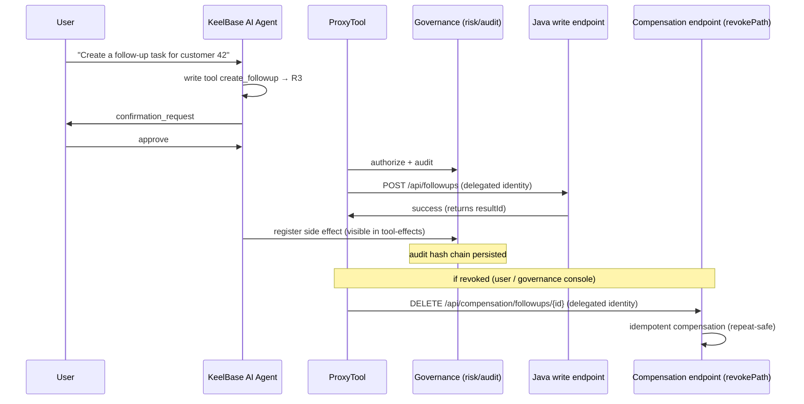
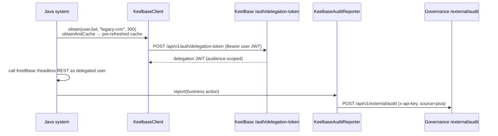

# Architecture & Data Flow — Connecting a Java System to KeelBase

> Overview doc: read this first, then dive into the component docs (delegated identity / tool declaration / compensation / client).
> The key idea: **KeelBase is the control plane (governance); your Java system is the data plane (business)**. KeelBase does not replace, migrate, or touch your data — it only decides *who the AI acts as, what it may do, whether a human must confirm, what happened, and whether a side effect can be revoked*.

---

## 1. Two integration paths — which one is this starter?

| Path | What it does | When to use | Starter's role |
|---|---|---|---|
| **A. Schema rebuild** | Legacy schema/OpenAPI → Protocol → generate CRUD+AI modules managed by KeelBase | Data can be taken over by KeelBase | Not applicable |
| **B. API proxy** | OpenAPI operations → proxy tools → **call existing system REST endpoints directly** (with delegated identity, under governance) | Cannot touch the old system; AI must operate live data | ✅ **This starter is the first-class Java adapter for path B** |

Honest clarification: **A is "new development inferred from the schema"; B is "operating the existing system".** Only B fully delivers "no migration, no rewrite". Choose the path first — do not treat A as B.

---

## 2. Control plane vs data plane: who governs what

```
┌─────────────────────────────┐        ┌──────────────────────────────┐
│  KeelBase (control/Trust)   │        │  Java system (data/Business) │
│                             │        │                              │
│  · delegation signing       │        │  · real business logic+data  │
│    (shared DELEGATION_SECRET)│  HTTP  │  · REST exposed via          │
│  · permission/risk/confirm  │ ◄────► │    @KeelbaseTool             │
│  · audit hash chain / revoke│ Bearer  │  · DelegationAuthFilter      │
│  · AI assistant / governance│  JWT    │  · compensation (idempotent) │
└─────────────────────────────┘        └──────────────────────────────┘
```

- **KeelBase never touches your database**: data stays in the Java system. KeelBase only sends commands (carrying a delegated identity), records audits, and triggers revocation.
- **The identity bridge**: both sides share `DELEGATION_SECRET`; the short-lived delegation JWT issued by KeelBase is the only trust credential between the two.

---

## 3. Data flows at a glance (three directions)

### Flow ① Call direction: KeelBase AI → Java system

The full path when the AI invokes a Java tool:

```mermaid
sequenceDiagram
    participant U as User
    participant A as KeelBase AI Agent
    participant T as ProxyTool
    participant F as DelegationAuthFilter
    participant J as Java Controller (@KeelbaseTool)

    U->>A: "Which customers are worth following up?"
    A->>A: decides to call list_customers (read → R1 auto)
    A->>T: execute tool
    T->>T: signs delegation JWT with DELEGATION_SECRET<br/>(sub=userId, oidcSub, aud=legacy-crm, 300s)
    T->>F: GET /api/customers<br/>Authorization: Bearer <delegation JWT>
    F->>F: verify HS256 + aud/iss/exp<br/>→ fail-open or reject
    F->>F: KeelBaseUserMapper maps oidcSub<br/>→ local user; out-of-scope → reject
    F->>J: inject @DelegationUser
    J->>J: execute business logic (data stays on-prem)
    J-->>A: returns data
    A-->>U: AI summarizes
```

### Flow ② Write operations: confirmation gate → side effect → revocation

Writes add three steps on top of reads: **human confirmation, side-effect registration, revocability**.



### Flow ③ Reverse direction: Java → KeelBase (optional, `keelbase-client` module)

Your Java system can also reach back into KeelBase — `KeelbaseClient` for a delegated identity, `KeelbaseAuditReporter` for audit reporting:



> Common thread across all three directions: **the identity is always "the delegated user", never the Java service itself** — the AI acts on behalf of a person, and audit trails back to that person.

---

## 4. Identity bridge (delegation JWT) details

| Item | Value |
|---|---|
| Issuer | KeelBase `POST /api/v1/auth/delegation-token` (authenticated user) |
| Claims | `{ sub: userId, oidcSub?, aud, iss:'keelbase', iat, exp }` |
| Algorithm / key | HS256, dedicated `DELEGATION_SECRET` (configure explicitly in production; do not fall back to sharing JWT_SECRET) |
| TTL | 300s by default (60–3600) — short-lived to prevent impersonation |
| `aud` | target system identifier (e.g. `legacy-crm`); both ends must agree |
| User mapping | prefer `oidcSub` (unified identity-source key); fall back to `local:<userId>`; out-of-scope access rejected |

**Responsibilities on each side**:

- **KeelBase side**: when executing a tool, `ProxyTool` signs a delegation JWT via `DelegationTokenService.sign(userId, audience)` → calls the Java endpoint with `Authorization: Bearer <delegation JWT>`.
- **Java side (this starter)**: `DelegationAuthFilter` verifies the JWT (HS256 + aud/iss/exp; fails fast at startup if secret/audience are missing) + `KeelBaseUserMapper` maps to a local user + `@DelegationUser` injection. The hand-written verification example is only a fallback for Java 8 / Spring Boot 2 systems (see [boot2-java8-adapter](boot2-java8-adapter.md)).

---

## 5. Governance & data boundary (must follow)

| Rule | Description |
|---|---|
| **Read R1 auto / write R3 confirm** | GET=R1 auto; POST·PUT·PATCH·DELETE=R3 needs human confirmation; high-risk writes (amounts / deletes / approvals) can be R4 dual approval / R5 blocked |
| **Data stays on-prem** | KeelBase only sends commands and parameters; business data / DB always stays in the Java system |
| **Short TTL + audience scoping** | 300s expiry + `aud` check prevent cross-system impersonation |
| **Out-of-scope rejected** | target system enforces row-level ownership via delegated identity; other users' data returns 403 (surfaced to the Agent as a tool failure) |
| **Revocation via compensation** | `revokePath` defines the compensation endpoint (idempotent, returns 2xx); KeelBase calls it with delegated identity when revoking a side effect |
| **Two-way audit** | KeelBase persists the hash chain; Java business actions reported via `KeelbaseAuditReporter` as `source=java`, visible alongside KeelBase's own AI audit |

---

## 6. Where to go next

| Topic | Doc |
|---|---|
| Full integration path | [Development Guide](development-guide.md) |
| 10-minute wiring | [Quick Start](quickstart.md) |
| Delegated identity / authorization | [Delegated Identity](delegated-identity.md) |
| Tool declaration / risk levels | [Tool Declaration](tool-declaration.md) |
| Revocation / compensation contract | [Compensation](compensation.md) |
| Reverse access (token + audit reporting) | [Client](client.md) |
| Real Java CRM reference | [Reference Project CRM](reference-project-crm.md) |
