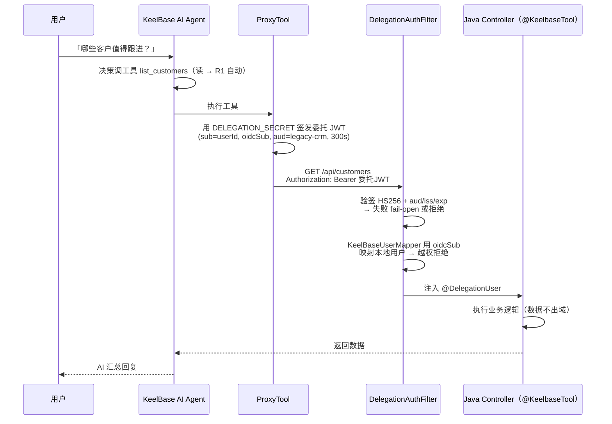
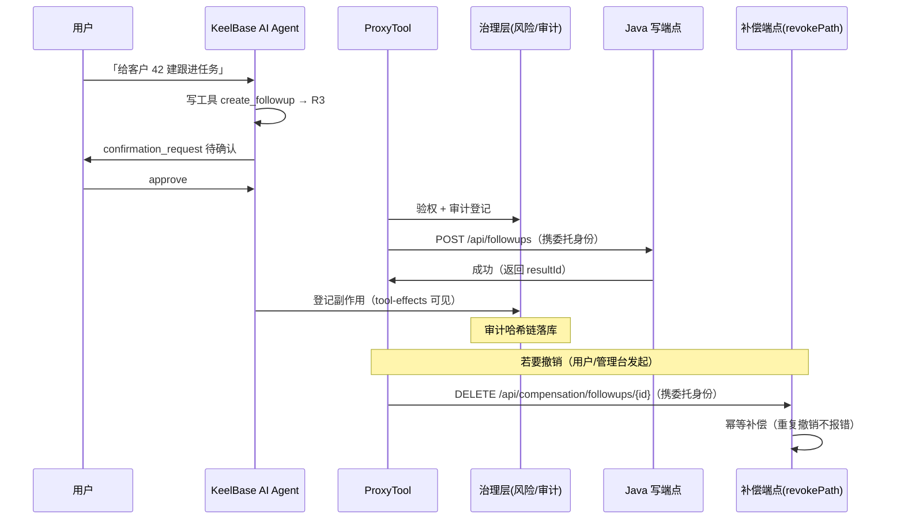
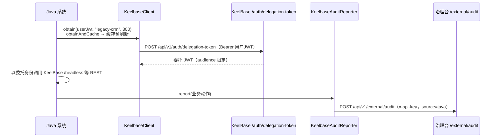

# 架构与数据流 — Java 系统如何通过 Starter 接入 KeelBase

> 总览文档：先看这张图再深入各组件文档（委托身份 / 工具声明 / 补偿 / 客户端）。
> 定位：**KeelBase 是控制面（治理），你的 Java 系统是数据面（业务）**。KeelBase 不替换、不迁移、不碰你的数据——它只负责「AI 以谁的身份、能不能、要不要确认、做了什么、可否撤销」。

---

## 1. 两条接入路径，Starter 走哪条

| 路径 | 做什么 | 适用 | Starter 角色 |
|---|---|---|---|
| **A. Schema 重建** | 老库 Schema/OpenAPI → 协议 → 生成 KeelBase 管理的 CRUD+AI 模块 | 数据可同库接管 | 不适用 |
| **B. API 代理** | OpenAPI operations → 代理工具 → **直接调已有系统 REST 端点**（携身份、过治理） | 不能动旧系统、AI 要操作在线数据 | ✅ **本 Starter 就是 B 路径的一等公民接入层** |

关键诚实说明：**A 是「由 Schema 反推的新开发」，B 才是「操作已有系统」**。「不迁移、不重写」只有 B 能完整兑现。接入先选路，不要把 A 当成 B。

---

## 2. 控制面与数据面：谁管什么

```
┌─────────────────────────────┐        ┌──────────────────────────────┐
│  KeelBase（控制面 / Trust）  │        │  Java 系统（数据面 / Business）│
│                             │        │                              │
│  · 委托身份签发（DELEGATION  │        │  · 真实业务逻辑与数据          │
│    _SECRET 共享密钥）        │  HTTP   │  · @KeelbaseTool 暴露 REST    │
│  · 权限 / 风险级 / 确认门控   │ ◄────► │  · DelegationAuthFilter 验签  │
│  · 审计哈希链 / 撤销补偿      │ Bearer  │  · 补偿端点（幂等撤销）        │
│  · AI 助手 / 治理台          │  JWT    │                              │
└─────────────────────────────┘        └──────────────────────────────┘
```

- **KeelBase 不碰你的数据库**：数据永远在 Java 侧，KeelBase 只下发指令（携带委托身份）、记录审计、发起撤销。
- **身份桥**：两端共享 `DELEGATION_SECRET`，KeelBase 签发的短期委托 JWT 是两端唯一的信任凭证。

---

## 3. 数据流总览（三种流向）

### Flow ① 调用方向：KeelBase AI → Java 系统

AI 在 KeelBase 侧发起对 Java 工具调用的完整路径：



### Flow ② 写操作：确认门控 → 副作用 → 撤销补偿

写操作比读多三步：**人工确认、副作用登记、可撤销**。



### Flow ③ 反向：Java → KeelBase（可选，`keelbase-client` 模块）

你的 Java 系统也能主动反向对接 KeelBase——用 `KeelbaseClient` 拿委托身份、用 `KeelbaseAuditReporter` 上报审计：



> 三个方向的共性是：**身份永远是「委托的用户」，而不是 Java 服务本身**——AI 代表某个人干活，审计也记到这个人头上。

---

## 4. 身份桥接（委托 JWT）细节

| 项 | 值 |
|---|---|
| 签发方 | KeelBase `POST /api/v1/auth/delegation-token`（已认证用户） |
| 载荷 | `{ sub: userId, oidcSub?, aud, iss:'keelbase', iat, exp }` |
| 算法/密钥 | HS256，独立 `DELEGATION_SECRET`（生产应显式配置，勿回退共用 JWT_SECRET） |
| 有效期 | 默认 300s（60–3600）——短期有效防冒用 |
| `aud` | 目标系统标识（如 `legacy-crm`），两端一致才放行 |
| 身份映射 | 优先 `oidcSub`（统一身份源映射键），无 OIDC 用 `local:<userId>`；越权（他人数据）拒绝 |

**两端职责**：

- **KeelBase 侧**：`ProxyTool` 执行工具时用 `DelegationTokenService.sign(userId, audience)` 签发委托 JWT → `Authorization: Bearer <委托 JWT>` 调 Java 端点。
- **Java 侧（本 Starter）**：`DelegationAuthFilter` 验签（HS256 + aud/iss/exp，启动时 secret/audience 缺失即 fail-fast）+ `KeelBaseUserMapper` 映射本地用户 + `@DelegationUser` 注入。手写验签示例仅作 Java 8 / Spring Boot 2 存量系统兜底（见 [boot2-java8-adapter](boot2-java8-adapter.md)）。

---

## 5. 治理与数据边界（必须遵守）

| 规则 | 说明 |
|---|---|
| **读 R1 自动 / 写 R3 确认** | GET=R1 自动执行；POST·PUT·PATCH·DELETE=R3 需人工确认；高风险写（金额/删除/审批）可配 R4 双人审批 / R5 阻断 |
| **数据不出域** | KeelBase 只传指令与参数，业务数据/库永远在 Java 侧 |
| **委托短时效 + audience 限定** | 300s 过期 + aud 校验，防跨系统冒用 |
| **越权拒绝** | 目标系统按委托身份做行级归属校验，他人数据返回 403（工具失败透传给 Agent 回退） |
| **撤销走补偿端点** | `revokePath` 约定补偿端点（幂等、返回 2xx），KeelBase 撤销副作用时携委托身份回调 |
| **审计双向** | KeelBase 侧落哈希链；Java 侧业务动作经 `KeelbaseAuditReporter` 上报 `source=java` 并列可见 |

---

## 6. 从哪个文档开始

| 想了解 | 文档 |
|---|---|
| 完整接入路径 | [开发使用手册](development-guide.md) |
| 10 分钟接线 | [快速开始](quickstart.zh-CN.md) |
| 委托身份/授权细节 | [委托身份与授权](delegated-identity.zh-CN.md) |
| 工具声明/风险级 | [工具声明与导出](tool-declaration.zh-CN.md) |
| 撤销补偿契约 | [补偿与撤销](compensation.zh-CN.md) |
| 反向接入（token + 审计上报） | [客户端与审计上报](client.zh-CN.md) |
| 真实 Java CRM 样板 | [参考项目 CRM](reference-project-crm.zh-CN.md) |
